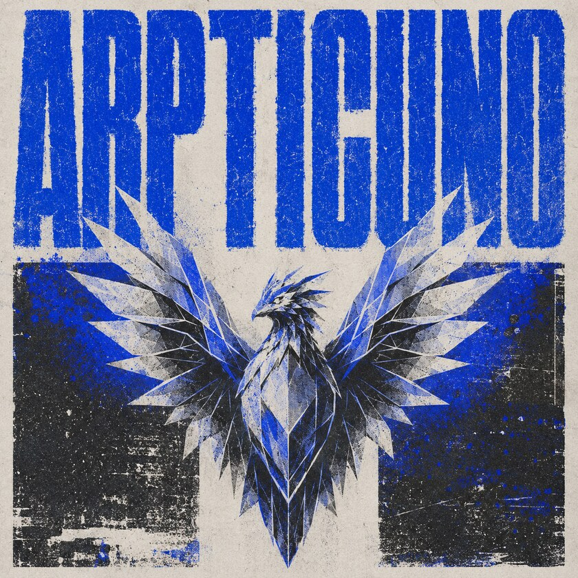

<p align="center">
  
</p>

<p align="center">
  Focused IPv4 LAN discovery and TCP connect scanning for authorized environments.
</p>

---

Arpticuno is a small Windows Python CLI for resolving IPv4 neighbors on RFC1918 private or link-local networks and reporting selected TCP connectivity results.

> Use Arpticuno only on systems and networks you own or have explicit permission to test.

## Install

You need Windows and Python 3.10 or newer.

```powershell
git clone https://github.com/delriscotechnologies/arpticuno.git
cd arpticuno
py -m venv .venv
.\.venv\Scripts\Activate.ps1
python -m pip install .
```

Run an authorized scan:

```powershell
arpticuno scan 192.168.1.0/24 --ports 22,80,443
```

## What it does

Arpticuno:

1. Validates RFC1918 private or IPv4 link-local targets.
2. Resolves IPv4-to-MAC mappings with the Windows IP Helper API.
3. Checks selected TCP ports with normal socket connections.
4. Produces table, JSON, or CSV output.

Windows may satisfy a resolution from its local ARP table; otherwise `SendARP` sends an ARP request. `--iface` accepts a local source IPv4 address to select the interface. `--retries` retries only unsuccessful resolutions.

The default TCP selection is ports `1-7000`. With `--fail-on-inconclusive`, the command returns exit code `3` when every TCP probe fails.

## Output

Supported formats:

- `table`
- `json`
- `csv`

JSON reports use `schema_version: 2.0`.

## Demo

The synthetic preview sends no network traffic:

```powershell
python -m arpticuno.sandbox
```

Example table output:

```text
      db                           mm     db
     ;MM:                          MM
    ,V^MM.    `7Mb,od8 `7MMpdMAo.mmMMmm `7MM  ,p6"bo `7MM  `7MM  `7MMpMMMb.  ,pW"Wq.
   ,M  `MM      MM' "'   MM   `Wb  MM     MM 6M'  OO   MM    MM    MM    MM 6W'   `Wb
   AbmmmqMA     MM       MM    M8  MM     MM 8M        MM    MM    MM    MM 8M     M8
  A'     VML    MM       MM   ,AP  MM     MM YM.    ,  MM    MM    MM    MM YA.   ,A9
.AMA.   .AMMA..JMML.     MMbmmd'   `Mbmo.JMML.YMbmd'   `Mbod"YML..JMML  JMML.`Ybmd9'
                         MM
                       .JMML.

                             +--------------------------+
                             |  Del Risco Technologies  |
                             +--------------------------+

Results: Target(s): 192.168.1.0/24 | Resolved hosts: 3 | TCP probes: 21000 | Open TCP ports: 5
Status: completed

Resolved hosts:
  Host 1
    IPv4: 192.168.1.1
    MAC: aa:bb:cc:dd:ee:01
    Resolve time: 1.2 ms
    TCP Probes: 7000
    Open TCP Ports: 2
      Port: 53/tcp | State: open | Latency: 0.8 ms
      Port: 80/tcp | State: open | Latency: 0.9 ms

  Host 2
    IPv4: 192.168.1.10
    MAC: aa:bb:cc:dd:ee:10
    Resolve time: 2.7 ms
    TCP Probes: 7000
    Open TCP Ports: 2
      Port: 22/tcp | State: open | Latency: 1.4 ms
      Port: 443/tcp | State: open | Latency: 1.8 ms

  Host 3
    IPv4: 192.168.1.25
    MAC: aa:bb:cc:dd:ee:25
    Resolve time: 3.4 ms
    TCP Probes: 7000
    Open TCP Ports: 1
      Port: 3389/tcp | State: open | Latency: 2.1 ms
```

## Scope and limits

Arpticuno is restricted to Windows, RFC1918 private or IPv4 link-local targets, and TCP connect scanning. Physical addresses can only be resolved for destinations on the local subnet.

| Limit | Maximum |
| --- | ---: |
| Comma-separated target entries | 256 |
| Distinct target addresses | 65,536 |
| Worst-case `SendARP` calls | 65,536 |
| Resolution retries | 5 |
| Resolved hosts | 256 |
| TCP ports per host | 65,535 |
| Concurrent TCP workers | 512 |
| TCP connect timeout | 10 seconds |
| Total TCP probes | 1,000,000 |

The `SendARP` call limit is calculated as `target addresses × (retries + 1)`. Successful resolutions stop retrying.

Resolve time measures the duration of the Windows resolution call and may represent a cached ARP-table lookup rather than network round-trip time.

See [SECURITY.md](SECURITY.md) for security notes.

## License

Arpticuno is released under the [MIT License](LICENSE).
